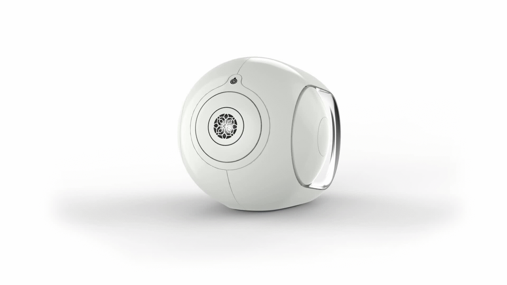
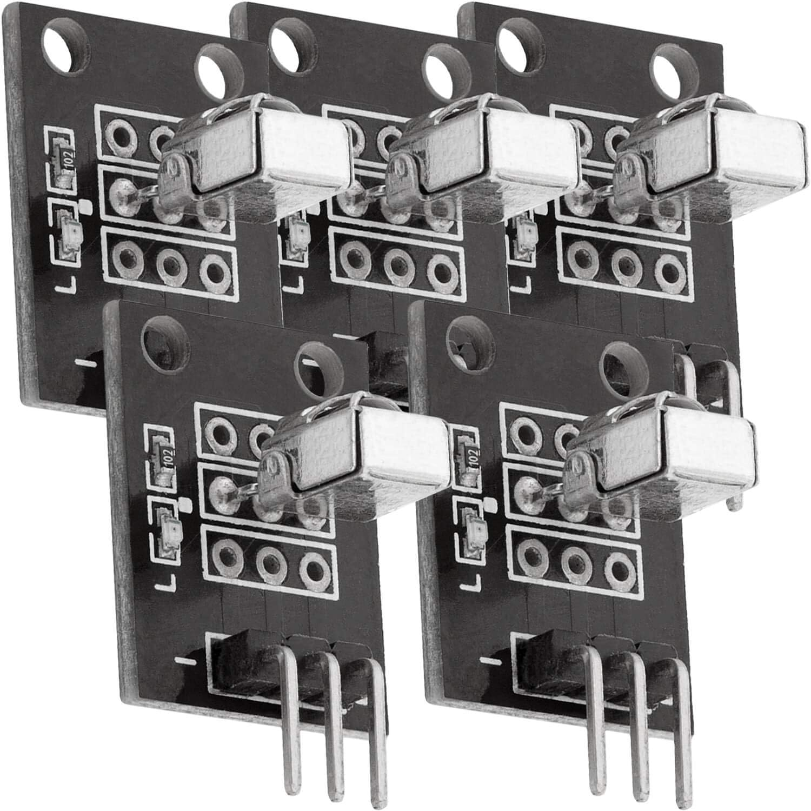
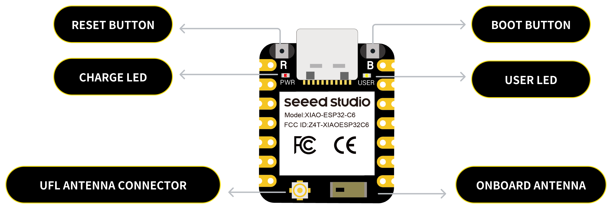

# devialet-ir

An ESP32 IR receiver to control the volume of Devialet speakers.

<p align="center">
  </img>
</p>

This project uses a IR Sensor to convert the IR signals of a remote to the following http post request:

```
GET http://{DEVIALET_IP}/ipcontrol/v1/systems/current/sources/current/soundControl/volume
{"volume":47}
POST http://{DEVIALET_IP}/ipcontrol/v1/systems/current/sources/current/soundControl/volume
{"volume":50}
```

Allowing to control the volume of a Phantom Speaker from an Apple TV Remote.

Finding the correct setup took some research as the ESP32-C6 is pretty recent and not completely supported by the tools I was using.

## Prerequisites

Here is what devices were used for the project:

- An Apple TV 4K (model=AppleTV11,1;iOS=17.6)
- An Apple Siri Remote (Charging via lightning)
- A LG TV (Model 42LD420)
- A Devialet Phantom II 98dB Speaker ([Link to the website](https://www.devialet.com/fr-fr/phantom-speaker/phantom-ii/phantom-ii-98db-white-stereo/))
- A Seeed Studio XIAO ESP32C6 Board ([Link to the official product](https://wiki.seeedstudio.com/xiao_esp32c6_getting_started/), [The website on which I bought it](https://www.gotronic.fr/art-carte-xiao-esp32c6-38917.htm))
- [IR Receiver](https://www.amazon.fr/dp/B07ZYZDW28) used for the build.

<p align="center">
  </img>
</p>

## Start the project

- Clone the repo
- Open the `devialet-ir.code-workspace` with VSCode
- It will suggest you to install platformIO, do so
- While it installs, Connect the IR receiver to the board. The S (Signal) pin should go to D10 on the board, the middle pin to the 3v3, and the I pin to the GND (Ground)
- Connect the ESP32C6 Board to your computer with a USB-C cable
- The PlatformIO should now be installed
- A new tab will appear on the left bar with an alien face
- From that menu you will be able to `Upload and Monitor` the firmware
- edit the `src/secrets.hpp` file to enter your wifi credentials

> Sometimes the board refused to be flashed. To fix it I had to:
>
> - disconnect from power/computer
> - stay pressed on the tiny B button next to the USB-C connector
> - while still pressed reconnect to the computer



## Boot sequence

- The yellow light stays ON until it is connected
- The device tries to connect to the wifi for 15s
- Once connected to the wifi, the yellow light turns off
- It then looks for the IP address of the Phantom Speaker
- The yellow light will turn on on each try
- After 10 tries, it will stop looking and blink with an error pattern if there is one
- If everything went well, the yellow light will turn off

## Blinking light error pattern

```
# Short flashes every 0.1s (0.1s OFF - 0.1s ON)
The device was unable to connect to the wifi
=============
# Short flashes every 0.4s (0.4s OFF - 0.1s ON)
There was an error starting the network discovery to get the IP address of the Phantom Speaker
```
